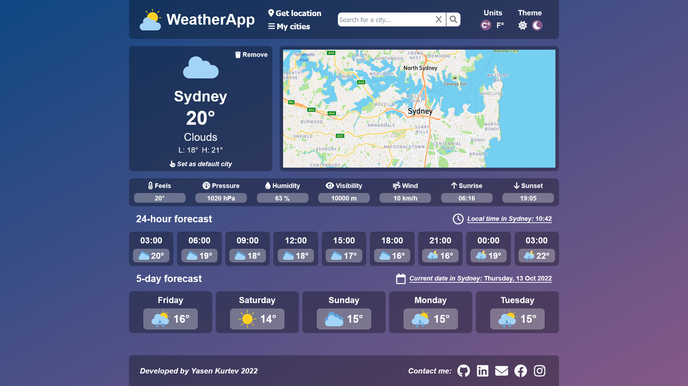
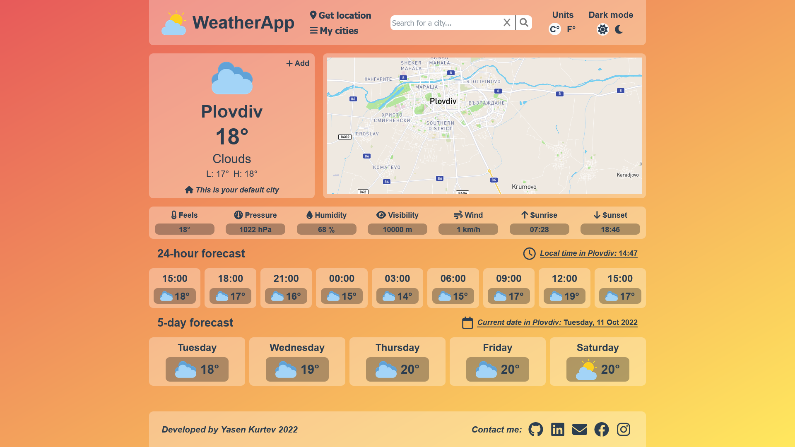
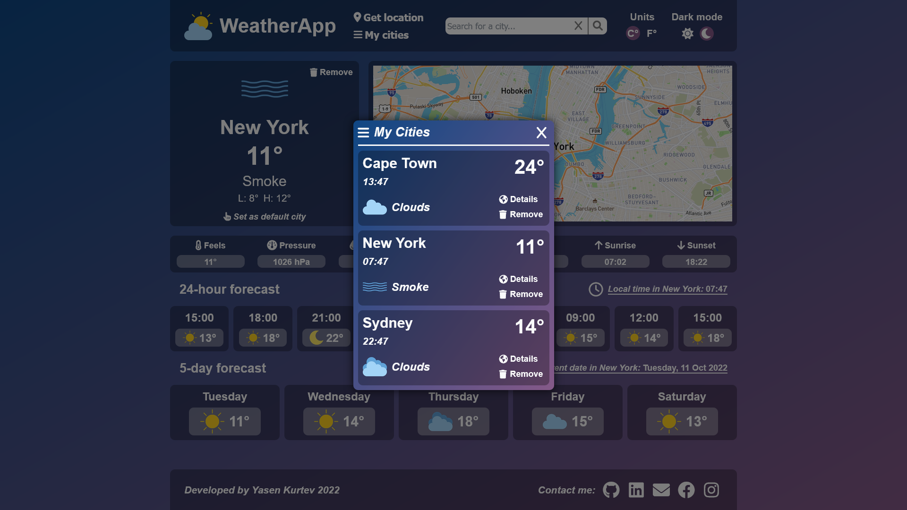
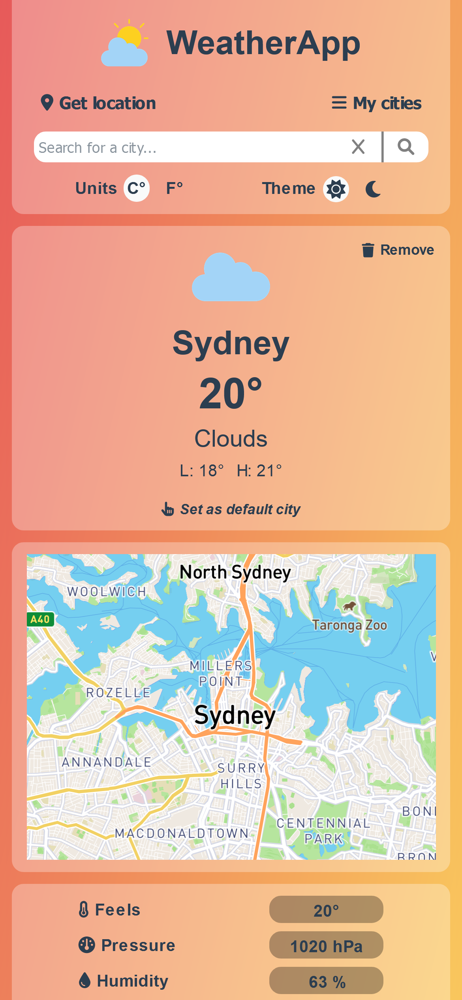
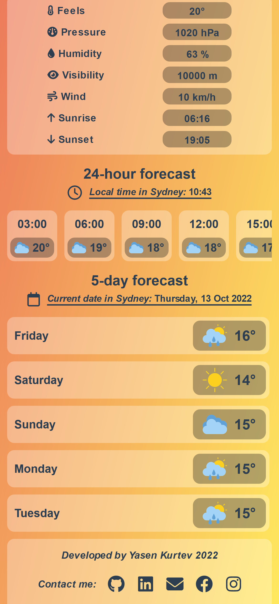
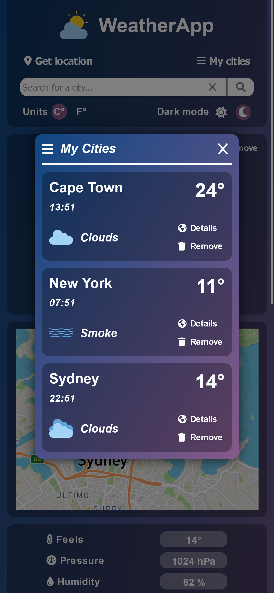
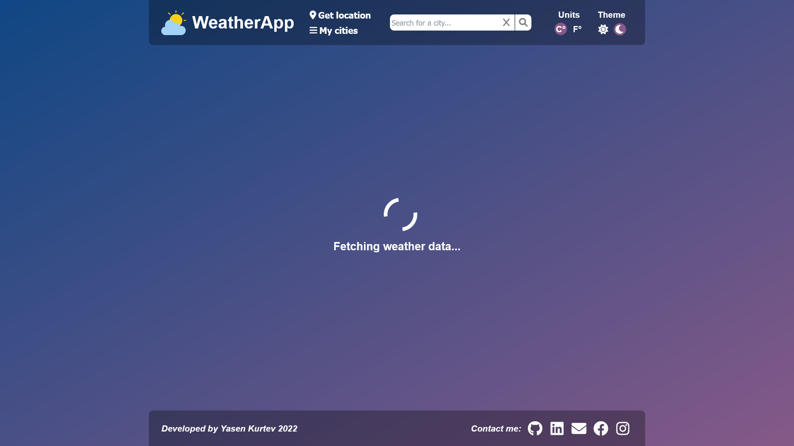
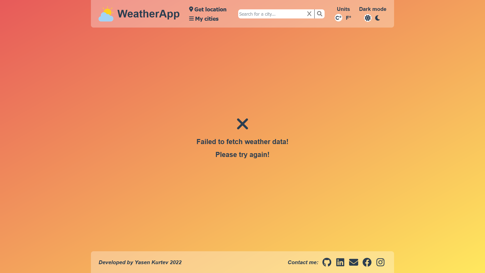
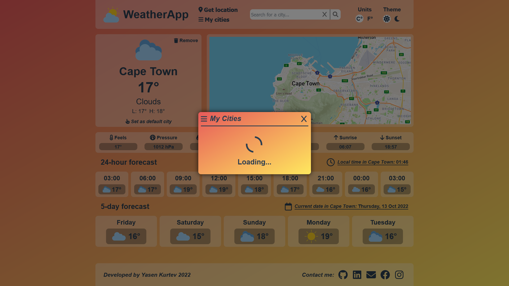
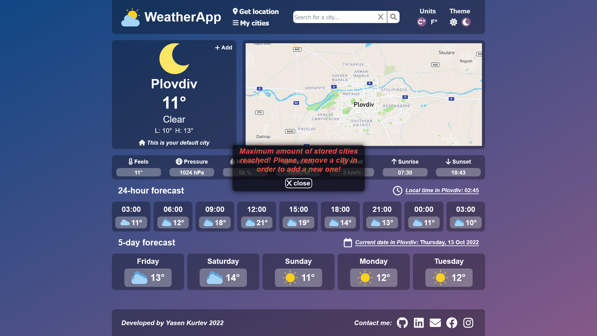

# 🌦️ React Weather App

A weather app for displaying daily and weekly weather for a current city.

## 💻 Used technologies and libraries

- ReactJS
- HTML
- CSS
- Styled Components
- Font Awesome Icons
- OpenWeatherMap API
- Mapbox GL JS

## ⚙️ Functionality

- Search city by name
- Search city by location / Geolocation API
- Light and Dark mode
- Celsius and Fahrenheit units
- Store favorite cities (you can store up to 3 cities)
- Set default city
- View city on the map
- Daily weather forecast
- Hourly weather forecast
- 5-day weather forecast

## 🌐 Live Demo

Demo Link

## 🛠️ App setup

Install all dependencies with `npm install`

The app uses OpenWeatherMap and Mapbox. In order to start the project, you are going to need access keys for both.<br/>
You can create an account and get your key here:<br/>
<a href="https://www.mapbox.com/">OpenWeatherMap</a><br/>
<a href="https://openweathermap.org/">Mapbox</a>

Create a file called .env in the root directory of the project and add the following code in the file:
```
REACT_APP_API_KEY_APPID='your-OpenWeatherMap-key'

REACT_APP_MAP_KEY_APPID='your-Mapbox-key'
```

## Screenshots
#### Dark mode


#### Light mode


#### My cities list


#### Mobile view
<p float="left">
  
  
  
</p>

#### Loading view, Fetch Error view, My cities loading view, Max stored cities view
<p float="left">
  
  
</p>
<p float="left">
  
  
</p>


This section has moved here: [https://facebook.github.io/create-react-app/docs/analyzing-the-bundle-size](https://facebook.github.io/create-react-app/docs/analyzing-the-bundle-size)

### Making a Progressive Web App

This section has moved here: [https://facebook.github.io/create-react-app/docs/making-a-progressive-web-app](https://facebook.github.io/create-react-app/docs/making-a-progressive-web-app)

### Advanced Configuration

This section has moved here: [https://facebook.github.io/create-react-app/docs/advanced-configuration](https://facebook.github.io/create-react-app/docs/advanced-configuration)

### Deployment

This section has moved here: [https://facebook.github.io/create-react-app/docs/deployment](https://facebook.github.io/create-react-app/docs/deployment)

### `npm run build` fails to minify

This section has moved here: [https://facebook.github.io/create-react-app/docs/troubleshooting#npm-run-build-fails-to-minify](https://facebook.github.io/create-react-app/docs/troubleshooting#npm-run-build-fails-to-minify)
