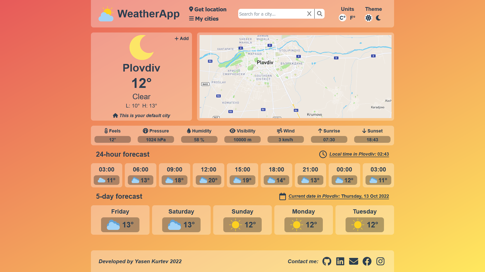
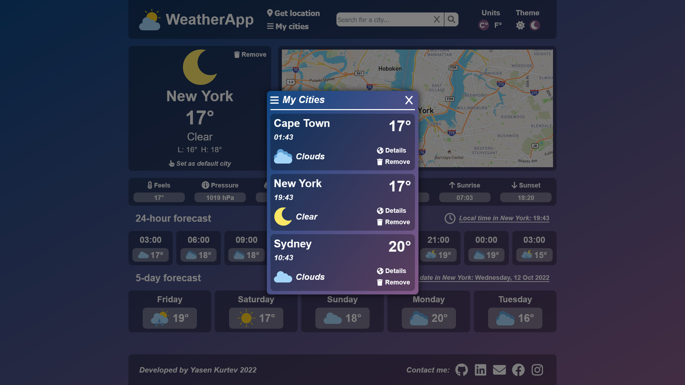
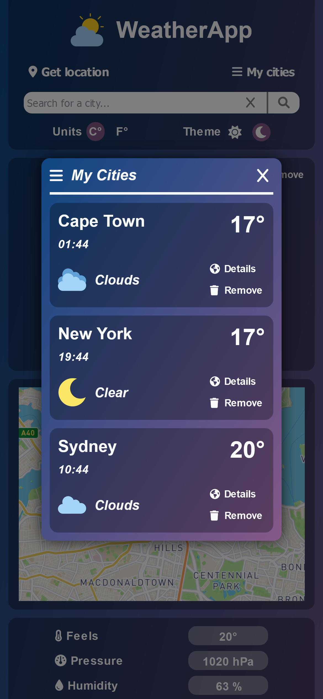

# 🌦️ React Weather App

A weather app which displays daily and weekly weather for a current city.

## 💻 Used technologies and libraries

- ReactJS
- HTML
- CSS
- Styled Components
- Font Awesome Icons
- Open Weather Map API
- Mapbox GL JS

## ⚙️ Functionality

- Search city by name
- Search city by location / Geolocation API
- Toggle between light and dark theme
- Toggle between celsius and fahrenheit temperature units
- Store favorite cities (you can store up to 3 cities)
- Set default city
- View city on the map
- Daily weather forecast
- Hourly weather forecast
- 5-day weather forecast

The app uses local storage to save user preferences, such as theme, units, favorite cities and default city.

## 🌐 Live Demo

You can view a live demo of the app here:<br/>
--> <a href="https://yasenkurtev.github.io/react-weather-app/">React Weather App</a><br/>

## 🛠️ App setup

Install all dependencies with `npm install`

The app uses OpenWeatherMap and Mapbox. In order to start the project, you are going to need access keys for both.<br/>
You can create an account and get your key here:<br/>
<a href="https://www.mapbox.com/">OpenWeatherMap</a><br/>
<a href="https://openweathermap.org/">Mapbox</a>

Create a file called .env in the root directory of the project and add the following code in the file:
```
REACT_APP_API_KEY_APPID='your-OpenWeatherMap-key'

REACT_APP_MAP_KEY_APPID='your-Mapbox-key'
```

## Screenshots
#### Dark theme


#### Light theme


#### My cities list


#### Mobile view
<p float="left">
  
  
  
</p>

#### Loading view, Fetch error view, My cities loading view, Max stored cities error view
<p float="left">
  
  
</p>
<p float="left">
  
  
</p>

## 📬 Feedback
Thank you for viewing my project!<br/>
If you have any questions, comments or you come across some bugs, please contact me through the contact info in my profile.<br/>
Any feedback is highly appreciated! 🙂
